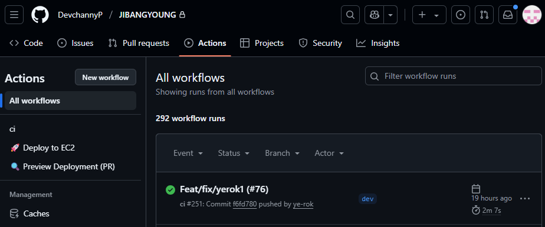
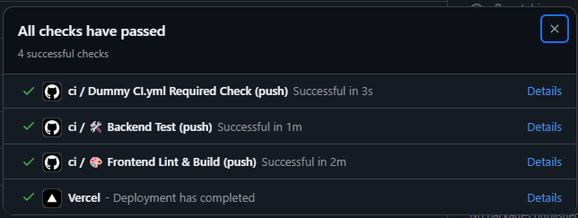
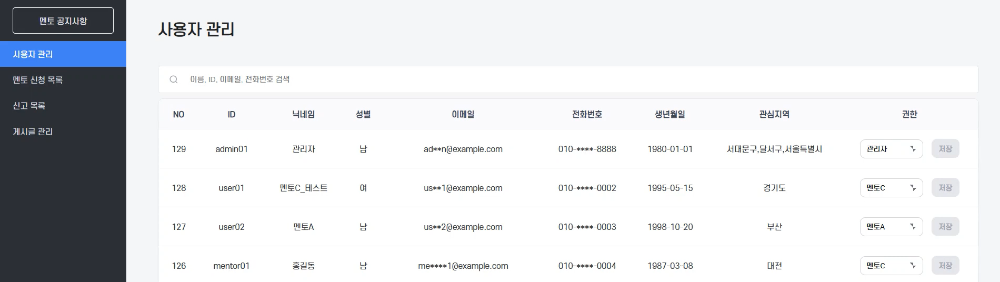
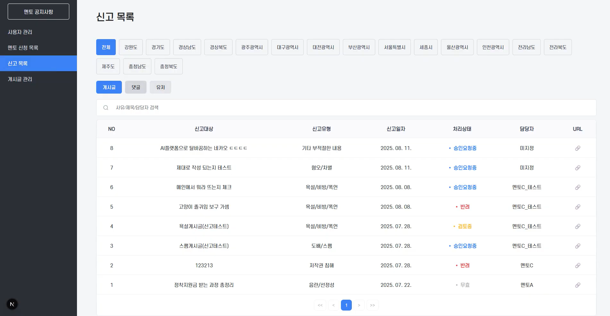
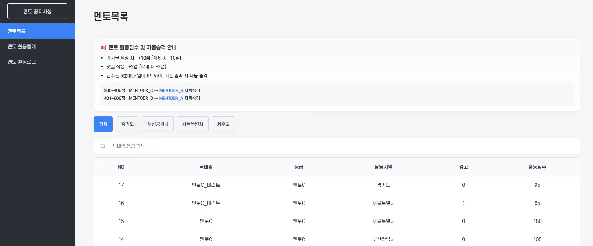
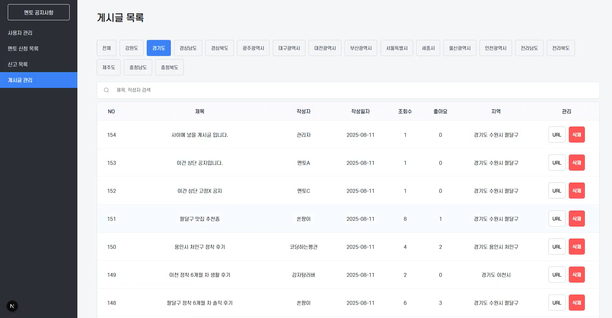
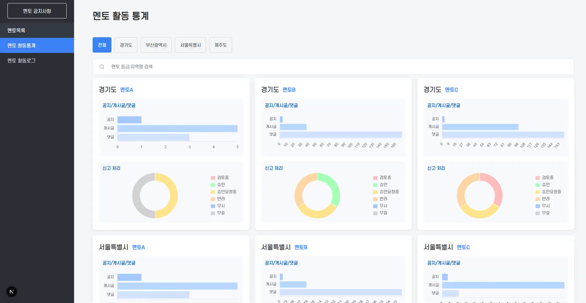

### ⭐ Local Youth Collaboration Platform (청년 지역 정착 지원 통합 그룹웨어)
### 소개 (Overview)

> 지방청년은 지방에 거주하는 청년들이 자신의 지역에서 활용할 수 있는 정책 정보를 쉽게 찾고, 지역별 커뮤니티를 통해 소통할 수 있도록 돕는 웹 플랫폼입니다. 수도권에 집중된 현재 상황에서 다양한 지방 정책들을 알려주어 지방 이주를 유도하고, 지방 정착을 지원하는 것을 목표로 합니다.

<br>

### 주요기능 (Features)
- 맞춤형 정책 추천 : 설문조사 기반 개인화 정책 추천 시스템
- 지역별 커뮤니티 : 지역 코드별 게시판을 통한 청년 간 소통 공간
- 정책 통합 관리 : 전국 청년 정책 정보 검색, 즐겨찾기, 상세 조회
- 멘토링 시스템 : 멘토 신청/승인, 공지사항 관리, 멘토 대시보드
- 대시보드 : 인기 게시글, 정책 랭킹, 지역별 통계 시각화
- 마이페이지 : 프로필 관리, 활동 내역, 지역 점수 시스템
- 관리자 시스템 : 사용자/게시글/신고 통합 관리, 멘토 승인

<Br>

### ⚙️ 기술 스택 (Tech Stack)
| 구분 | 사용 기술 |
|------|----------|
| **Frontend** | Next.js(App Router), TypeScript, CSS Modules, Zustand, TanStack Query |
| **Backend** | Spring Boot 3.5.4, Java 17, JPA/Hibernate, QueryDSL |
| **Auth** | OAuth2(Naver), JWT, Spring Security |
| **Database** | MariaDB, Redis (조회 성능 개선을 위한 캐싱 구조 설계) |
| **Infra** | AWS EC2, AWS S3, Docker, Docker Compose |
| **Architecture** | Modular Monolithic, Domain → Application → UI Layer |
| **CI/CD** | GitHub Actions (CI / CD / Preview) |
| **Monitoring & Batch** | Spring Boot Actuator, Spring Scheduler (다중 스케줄러 운영) |

<Br>

### 📂 프로젝트 구조 (Project Structure)

```bash
JIBANGYOUNG/
├── backend/                 # Spring Boot 백엔드
│   ├── domain/              # 도메인 중심 비즈니스 로직
│   │   ├── admin/           # 관리자 운영 및 제어
│   │   ├── mentor/          # 멘토 신청 및 자동 승급 시스템
│   │   ├── policy/          # 정책 추천 및 조회
│   │   ├── community/       # 지역 커뮤니티
│   │   └── survey/          # 설문 및 추천 로직
│   └── global/              # 공통 설정 (Security, JWT, Config)
│
├── frontend/                # Next.js 기반 UI
│   ├── app/                 # App Router 페이지 구조
│   ├── components/          # 재사용 UI 컴포넌트
│   ├── libs/                # API 통신 및 유틸
│   └── types/               # TypeScript 타입 정의
│
└── infra/                   # 인프라 및 배포 환경
    ├── docker/              # Docker 설정
    └── scripts/             # 배포 및 실행 스크립트
```

<br>

### 📂 전체 아키텍처 (Architecture)
- 핵심 도메인 분리 + 계층화된 구조로 서비스 확장성 확보

```bash
[Client - Next.js] 
   ↓ (REST API)
[Spring Boot Application]
   ├─ Admin Domain
   ├─ Mentor Domain
   ├─ Policy / Community / Survey
   └─ Authentication (OAuth2, JWT)
   ↓
[MariaDB + Redis]
   ↓
[AWS EC2 Deployment & GitHub Actions CI]
```

<br>

### ⚙️ 내가 담당한 핵심 기능 (My Contributions)

### 1. 멘토 자동 승급 시스템 (핵심)

**문제**
- 기존 구조: 관리자 수동 승인 및 관리 필요
- 운영 비용 증가 + 실시간 반영 어려움

**해결**
- 멘토 활동 로그 기반 점수 계산 구조 설계
- `@Scheduled` 기반 자동 승급 처리 (Spring Scheduler)
- `ShedLock` 적용으로 분산 환경에서 스케줄러 중복 실행 방지
- 사용자 활동 로그를 기반으로 점수 집계 로직 구성

**결과**
- 멘토 활동 기반 자동 승급 시스템 구축
- 관리자 개입 없이 운영 자동화 달성
- 권한 변화 흐름 시스템화
- 운영 자동화를 위해 멘토 권한이 자동으로 변화하는 구조 설계
- 핵심 소스: `domain/mentor/*.java`
```
멘토 신청

  ↓ (신청 정보 저장)

관리자 승인 (1차 / 최종)

  ↓ (Role 변경: USER → MENTOR)

멘토 활동 로그 누적

  ↓ (활동 점수 계산 및 갱신)

멘토 등급 유지 / 자동 승급
```

<br>

### 2. Admin 운영 및 제어 시스템

- 관리자 중심의 플랫폼 운영 로직 통합 관리
- 사용자 / 멘토 / 신고 / 정책 데이터를 하나의 흐름으로 제어
- `QueryDSL` 기반 동적 조건 검색 및 페이징 처리
- 주요 운영 행위에 대해 Audit 로그 기록 구조 설계
- 사용자 활동 로깅을 위한 AOP 기반 추적 구조 일부 반영
- 운영 효율을 고려한 관리자 중심 제어 시스템 구현
- 핵심 소스: `domain/admin/*.java`
```
신고 또는 운영 이슈 발생
   ↓
관리자 검토
   ↓
권한 조정 / 콘텐츠 블라인드 처리 / 상태 변경
   ↓
처리 이력 로그 저장
```

<br>

### 3. 인증 & 권한 제어
- `JWT` 기반 인증 (Access / Refresh Token 분리)
- `OAuth2 (Naver)` 소셜 로그인 연동
- `Spring Security` 기반 Role(`USER / ADMIN / MENTOR`) 접근 제어
- Bean Validation 및 커스텀 검증 로직 적용
- 사용자 권한에 따라 기능과 데이터 접근이 분리되는 구조 구현

| 구성              | 설명                     |
| --------------- | ---------------------- |
| OAuth2 로그인      | Google/Social 로그인 연동   |
| JWT 토큰 인증       | Stateless 방식           |
| Spring Security | URI 접근 제어, Role 기반 필터링 |

<br>

### 4. CI/CD & DevOps
- GitHub Actions 기반 CI/CD 파이프라인 구성
- Backend 테스트 및 Frontend 빌드 자동화
- Preview / CI / CD 워크플로우 분리 운영
- Docker 기반 배포 환경 구성

| 항목                    |         상태        |
| --------------------- | :---------------: |
| Backend Unit Test     |       🟢 성공       |
| Frontend Lint + Build |       🟢 성공       |
| Required Check        |       🟢 성공       |
| AWS Deploy (CD)       | 🔒 Secret 제거로 비활성 |



<Br>

### 주요 기술적 특징 (Features)
**보안**
- JWT 기반 인증: Access/Refresh Token 분리
- 소셜 로그인: 네이버 OAuth2 연동
- 권한 관리: 사용자 역할별 접근 제어 (USER, ADMIN, MENTOR)
- 입력 검증: Bean Validation 및 커스텀 검증 로직

**성능 최적화**
- Redis 캐싱: 자주 조회되는 데이터 캐싱
- TanStack Query (React Query): 서버 상태 관리 및 캐싱

**모니터링 및 로깅**
- 사용자 활동 로깅: AOP 기반 활동 추적 (@UserActivityLogging)
- Spring Batch: 대용량 로그 데이터 처리
- ShedLock: 분산 환경에서 스케줄러 중복 실행 방지
- 다중 스케줄러: 토큰 정리, 캐시 갱신, 점수 집계 등 7개 스케줄러 운영
  
**데이터베이스 설계**
- JPA + QueryDSL: 타입 안전한 동적 쿼리
- 지역 점수 시스템: 사용자별 지역 활동 점수 집계
- 계층형 댓글: 대댓글 구조 지원

<Br>

### ⚡ 문제 해결 경험 (Troubleshooting)
1. 스케줄러 중복 실행 문제 <br>
- 문제: 서버 재시작 시 스케줄러 중복 실행 가능성
  - 해결: `ShedLock` 적용
  - 결과: 단일 실행 보장 (멀티 인스턴스 대응)

<br>

2. 승급 로직 중복 실행 문제 (멱등성)
- 문제: 반복 실행 시 중복 승급 위험
  - 해결: 현재 `Role` 기준 조건부 업데이트
  - 결과: 동일 작업 반복 실행에도 데이터 일관성 유지

<br>

3. 조회 성능 개선 설계
- 문제: 게시글 및 인기 데이터 조회 빈도 높음
  - 해결: Redis 캐싱 구조 설계
  - 결과: DB 부하 감소 및 응답 속도 개선 방향 확보

<br>

### ⚙️ 설계 의도 (Design Decision)
- 모듈형 모놀리식 구조 선택 → 빠른 개발 + 도메인 중심 설계에 적합
- `Scheduler` 도입 → 운영 자동화 및 관리자 의존도 감소
- `QueryDSL` 사용 → 동적 쿼리 및 유지보수성 확보
- `Redis` 캐싱 고려 → 조회 성능 개선 및 확장성 대응

<Br>

### 📈 개선 포인트
- N+1 문제 개선 (`fetch join` 활용)
- `QueryDSL` 기반 검색 구조 개선
- 인증 구조 확장 (`JWT` + `OAuth2`)

<Br>

### 🔍 화면 예시 (Screenshots)






<Br>

### 📄 배운 점 (What I Learned)

- 모듈형 모놀리식 설계를 실 서비스에 적용
- QueryDSL 기반 조건 검색 & 도메인 구분
- OAuth2 + JWT 인증체계 구축 경험
- GitHub Actions 기반 CI 구현
- 협업 환경에서의 코드 리뷰/분담 경험
- 서비스 백엔드 핵심 도메인 주도 개발

### 🎯 한 줄 정리
운영 자동화와 권한 기반 시스템 설계를 중심으로 구현한 백엔드 프로젝트
